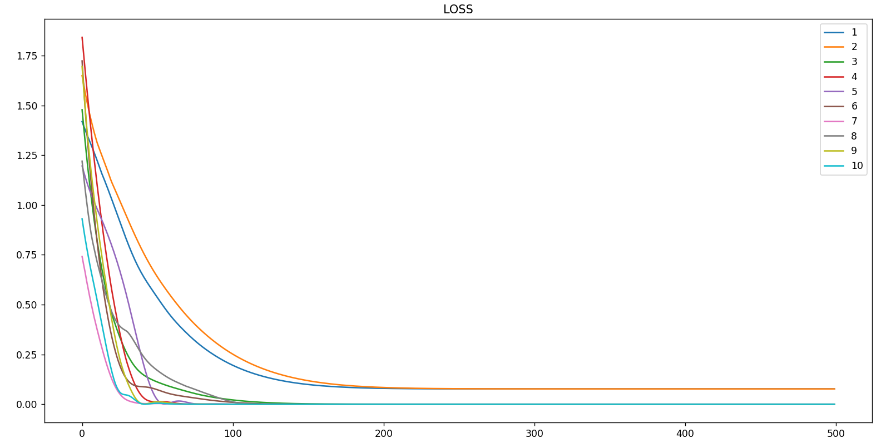
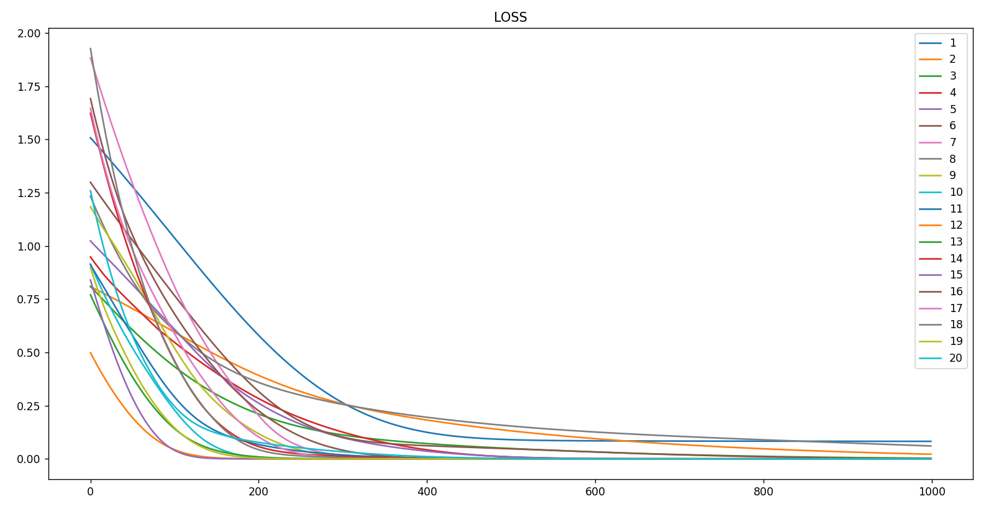

### Data

Bedrooms|Area|Age|Price
-|-|-|-
2|18|25|1000
1|6|12|500
2|12|35|1200

### Data visual no normalize

### Data visual with normalize

### Train with 1-10 hidden neurons

### Change data

Bedrooms|Area|Age|Price
-|-|-|-
2|18|25|998
1|6|12|501
2|12|35|1205

### Loss

### Result
`Giá trị dự đoán: [[ 998.       501.00003 1205.     ]]`

### 1-20 lr=0.01

- lr=0.1
