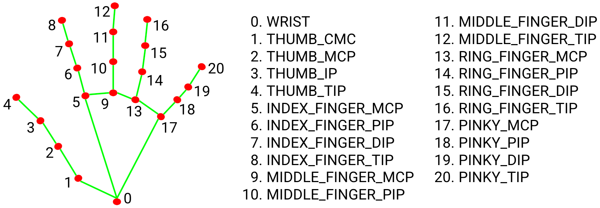

Nguyên lý hoạt động của Mediapipe Hand dựa trên việc kết hợp các kỹ thuật phát hiện đối tượng, mạng neural, và theo dõi chuyển động. Dưới đây là các bước chính:

1. **Phát hiện bàn tay**:
   - **Sử dụng mạng neural**: Sử dụng một mạng neural để phát hiện hộp chứa bàn tay (bounding box) trong khung hình. Mạng neural này được huấn luyện trên một tập dữ liệu lớn chứa các hình ảnh bàn tay ở nhiều góc độ và điều kiện ánh sáng khác nhau.
   - **Output**: Tọa độ của hộp chứa bàn tay.

2. **Xác định điểm mốc (landmarks)**:
   - **Mạng neural thứ hai**: Sử dụng một mạng neural thứ hai để xác định 21 điểm mốc trên bàn tay từ hình ảnh đã được crop theo hộp chứa. Mạng này được huấn luyện để nhận diện các điểm đặc trưng như đầu ngón tay, khớp, và lòng bàn tay.
   - **Output**: Tọa độ của 21 điểm mốc trên bàn tay.

3. **Theo dõi chuyển động**:
   - **Kalman Filter**: Sử dụng Kalman Filter hoặc các kỹ thuật theo dõi khác để theo dõi vị trí của các điểm mốc qua các khung hình. Điều này giúp giảm thiểu nhiễu và cải thiện độ mượt mà của chuyển động.
   - **Output**: Các điểm mốc được theo dõi liên tục, cập nhật theo thời gian thực.

4. **Tích hợp và xử lý thời gian thực**:
   - **Tiền xử lý ảnh**: Chuyển đổi ảnh đầu vào (thường là từ camera) sang không gian màu RGB và chuẩn hóa.
   - **Hậu xử lý**: Vẽ các điểm mốc và kết nối chúng để tạo ra mô hình khung xương của bàn tay trên ảnh đầu vào.

5. **Pipeline**:
   - **Modular**: Mediapipe sử dụng kiến trúc pipeline modular, cho phép dễ dàng kết hợp các module khác nhau như phát hiện bàn tay, xác định điểm mốc, và theo dõi.
   - **Parallel Processing**: Tận dụng khả năng xử lý song song để đảm bảo hiệu suất cao, đặc biệt là trên các thiết bị có tài nguyên hạn chế như điện thoại di động.

6. **Ứng dụng và cải tiến**:
   - **Tương tác người-máy**: Ứng dụng trong các hệ thống điều khiển bằng cử chỉ, thực tế ảo (VR), và thực tế tăng cường (AR).
   - **Tối ưu hóa**: Liên tục cập nhật và tối ưu hóa các mô hình mạng neural để cải thiện độ chính xác và tốc độ.

Nhờ vào các bước trên, Mediapipe Hand có thể nhận diện và theo dõi bàn tay một cách chính xác và hiệu quả trong thời gian thực.
