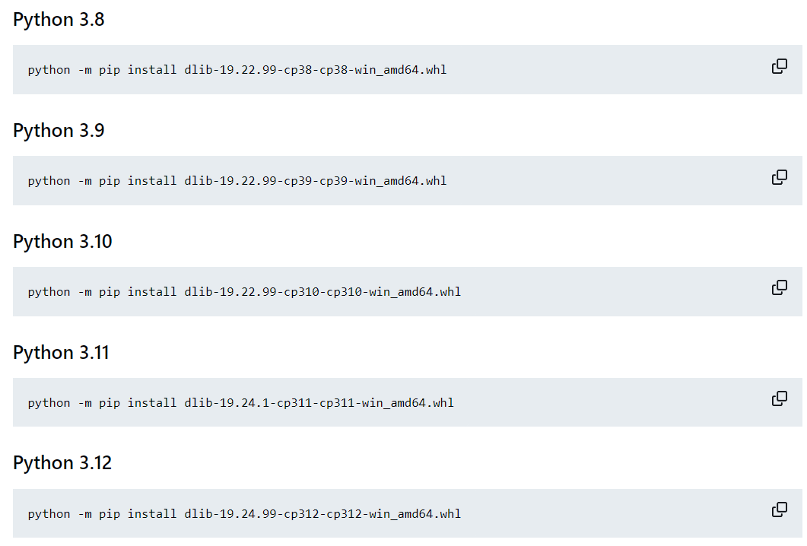
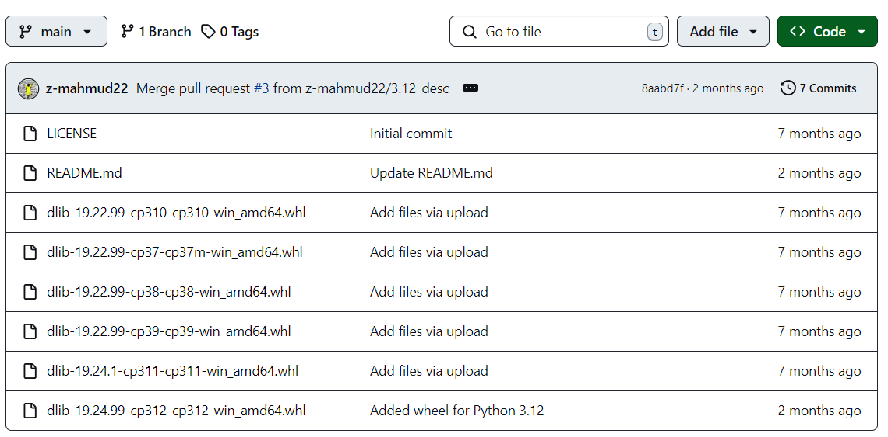
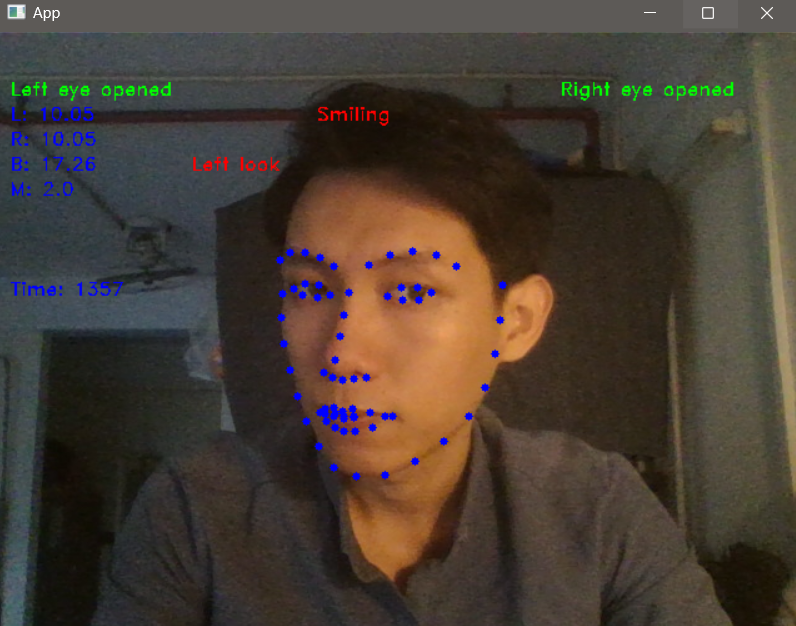
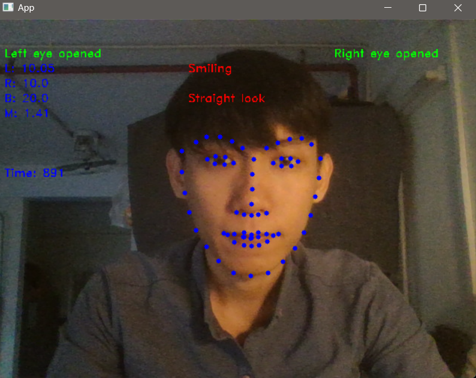
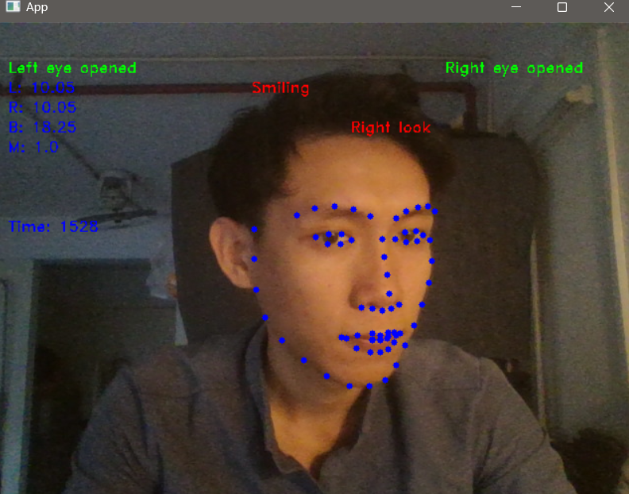
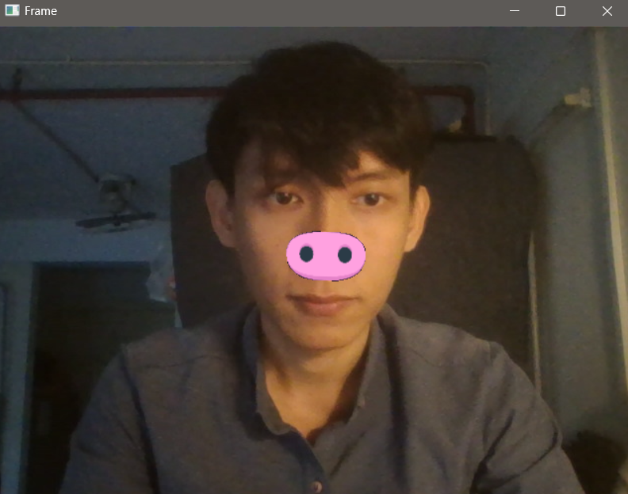
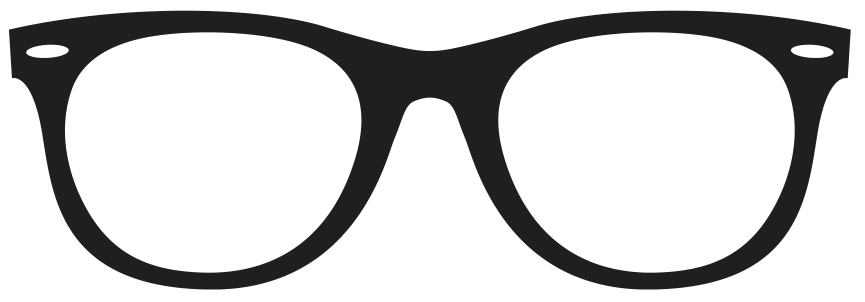
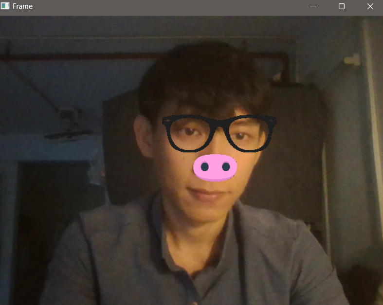

# Project: FACE DIRECTION & FACE FILTER
    Inbox me if these is any problem or issue, or email: catunderrainvn@gmail.com
---
## Installation
### Step 1: Install Dlib
- Go to link [Dlib](https://github.com/z-mahmud22/Dlib_Windows_Python3.x)<br>
- Download the right .whl file for your python version (download by click to the right .whl file, then tự mò lấy :v)

    |Version|Download|
    |:-:|:-:|
    |||

- After having your .whl file on you laptop, move this file to your Desktop
- Open CMD, and use 'cd' command to cd your current directory to Desktop, for example `cd c:\users\lenovo\desktop` on window (linux and mac check ysf :D)
    ```
    C:\Users\Lenovo>cd desktop
    C:\Users\Lenovo\Desktop>
    ```
- I also downloaded a .whl file for python v12 in this folder, which is `dlib-19.24.99-cp312-cp312-win_amd64.whl`, if there be any issues in your website downloading process, you can use this file instead.
- After that, run the install pip command like, in the link above, for ex with python 12:

    `python -m pip install dlib-19.24.99-cp312-cp312-win_amd64.whl`
- If you install dlib sucessfully, then you can try out those interesting project below. If not, try fricking out again, use GPT, Google or anything. Without finding the sucess, turn it off and go sleeping.
- Now, you can `import dlib` in python file, and go to step 2.

### Step 2: Download Face Landmarks file
- In fact, I already include the file `shape_predictor_68_face_landmarks.dat` in this repo, so that you can clone it, or simply download it, or get it from the source page [68 landmarks](https://github.com/italojs/facial-landmarks-recognition/).

### Step 3: Go enjoy
- Yeah, go.
---

## Face Direction
Run file: [FACE_INFO.py](FACE_INFO.py)

Result:
|Left|Straight|Right|
|:-:|:-:|:-:|
||||
---
## Add Pignose Filter
Run file: [PIGNOSE.py](PIGNOSE.py)

Result:

|Nose Image|Result Image|
|:-:|:-:|
|||
---
### Add Glass Filter
Run file: [GLASS_NOSE.py](GLASS_NOSE.py)

Result:

|Glass Image|Result Image|
|:-:|:-:|
|||
---
# CONCLUSION
**In further, you can replace Pignose or Glass with any features you want, improve this with your own code and must to understand that, this projects give you a nice look of what Machine Learning can do to imporve life experience of us. However, this is just funny, NOT a real thing or serious stuff that get you an AI/ML student. Keep going, keep exploring and keep, mother keep.**

Thai Toan