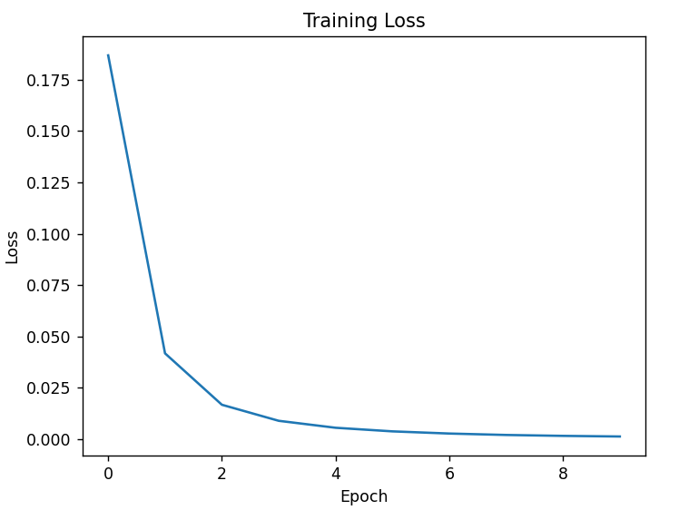
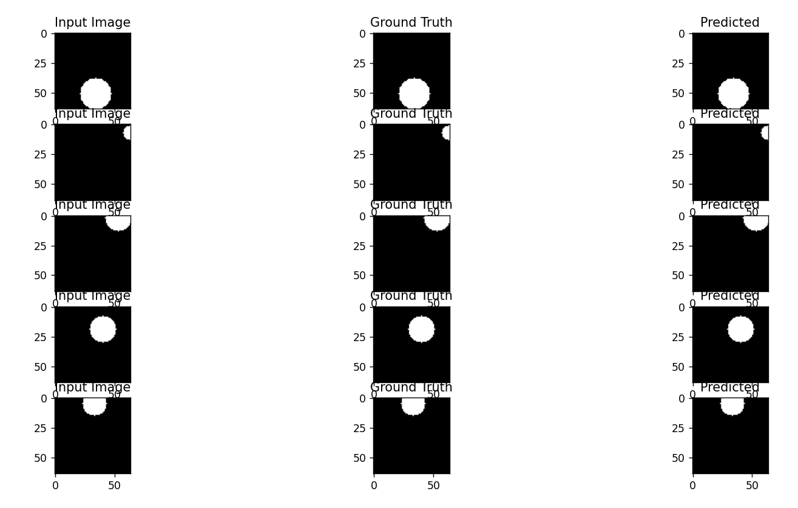

# U-Net
## Loss


## Result


## Report
```rs
Using device: cuda
```
### UNet Arch.
```rs
UNet(
  (encoder1): Sequential(
    (0): Conv2d(1, 32, kernel_size=(3, 3), stride=(1, 1), padding=(1, 1), bias=False)
    (1): BatchNorm2d(32, eps=1e-05, momentum=0.1, affine=True, track_running_stats=True)
    (2): ReLU(inplace=True)
    (3): Conv2d(32, 32, kernel_size=(3, 3), stride=(1, 1), padding=(1, 1), bias=False)
    (4): BatchNorm2d(32, eps=1e-05, momentum=0.1, affine=True, track_running_stats=True)
    (5): ReLU(inplace=True)
  )
  (pool1): MaxPool2d(kernel_size=2, stride=2, padding=0, dilation=1, ceil_mode=False)
  (encoder2): Sequential(
    (0): Conv2d(32, 64, kernel_size=(3, 3), stride=(1, 1), padding=(1, 1), bias=False)
    (1): BatchNorm2d(64, eps=1e-05, momentum=0.1, affine=True, track_running_stats=True)
    (2): ReLU(inplace=True)
    (3): Conv2d(64, 64, kernel_size=(3, 3), stride=(1, 1), padding=(1, 1), bias=False)
    (4): BatchNorm2d(64, eps=1e-05, momentum=0.1, affine=True, track_running_stats=True)
    (5): ReLU(inplace=True)
  )
  (pool2): MaxPool2d(kernel_size=2, stride=2, padding=0, dilation=1, ceil_mode=False)
  (encoder3): Sequential(
    (0): Conv2d(64, 128, kernel_size=(3, 3), stride=(1, 1), padding=(1, 1), bias=False)
    (1): BatchNorm2d(128, eps=1e-05, momentum=0.1, affine=True, track_running_stats=True)
    (2): ReLU(inplace=True)
    (3): Conv2d(128, 128, kernel_size=(3, 3), stride=(1, 1), padding=(1, 1), bias=False)
    (4): BatchNorm2d(128, eps=1e-05, momentum=0.1, affine=True, track_running_stats=True)
    (5): ReLU(inplace=True)
  )
  (pool3): MaxPool2d(kernel_size=2, stride=2, padding=0, dilation=1, ceil_mode=False)
  (encoder4): Sequential(
    (0): Conv2d(128, 256, kernel_size=(3, 3), stride=(1, 1), padding=(1, 1), bias=False)
    (1): BatchNorm2d(256, eps=1e-05, momentum=0.1, affine=True, track_running_stats=True)
    (2): ReLU(inplace=True)
    (3): Conv2d(256, 256, kernel_size=(3, 3), stride=(1, 1), padding=(1, 1), bias=False)
    (4): BatchNorm2d(256, eps=1e-05, momentum=0.1, affine=True, track_running_stats=True)
    (5): ReLU(inplace=True)
  )
  (pool4): MaxPool2d(kernel_size=2, stride=2, padding=0, dilation=1, ceil_mode=False)
  (bottleneck): Sequential(
    (0): Conv2d(256, 512, kernel_size=(3, 3), stride=(1, 1), padding=(1, 1), bias=False)
    (1): BatchNorm2d(512, eps=1e-05, momentum=0.1, affine=True, track_running_stats=True)
    (2): ReLU(inplace=True)
    (3): Conv2d(512, 512, kernel_size=(3, 3), stride=(1, 1), padding=(1, 1), bias=False)
    (4): BatchNorm2d(512, eps=1e-05, momentum=0.1, affine=True, track_running_stats=True)
    (5): ReLU(inplace=True)
  )
  (upconv4): ConvTranspose2d(512, 256, kernel_size=(2, 2), stride=(2, 2))
  (decoder4): Sequential(
    (0): Conv2d(512, 256, kernel_size=(3, 3), stride=(1, 1), padding=(1, 1), bias=False)
    (1): BatchNorm2d(256, eps=1e-05, momentum=0.1, affine=True, track_running_stats=True)
    (2): ReLU(inplace=True)
    (3): Conv2d(256, 256, kernel_size=(3, 3), stride=(1, 1), padding=(1, 1), bias=False)
    (4): BatchNorm2d(256, eps=1e-05, momentum=0.1, affine=True, track_running_stats=True)
    (5): ReLU(inplace=True)
  )
  (upconv3): ConvTranspose2d(256, 128, kernel_size=(2, 2), stride=(2, 2))
  (decoder3): Sequential(
    (0): Conv2d(256, 128, kernel_size=(3, 3), stride=(1, 1), padding=(1, 1), bias=False)
    (1): BatchNorm2d(128, eps=1e-05, momentum=0.1, affine=True, track_running_stats=True)
    (2): ReLU(inplace=True)
    (3): Conv2d(128, 128, kernel_size=(3, 3), stride=(1, 1), padding=(1, 1), bias=False)
    (4): BatchNorm2d(128, eps=1e-05, momentum=0.1, affine=True, track_running_stats=True)
    (5): ReLU(inplace=True)
  )
  (upconv2): ConvTranspose2d(128, 64, kernel_size=(2, 2), stride=(2, 2))
  (decoder2): Sequential(
    (0): Conv2d(128, 64, kernel_size=(3, 3), stride=(1, 1), padding=(1, 1), bias=False)
    (1): BatchNorm2d(64, eps=1e-05, momentum=0.1, affine=True, track_running_stats=True)
    (2): ReLU(inplace=True)
    (3): Conv2d(64, 64, kernel_size=(3, 3), stride=(1, 1), padding=(1, 1), bias=False)
    (4): BatchNorm2d(64, eps=1e-05, momentum=0.1, affine=True, track_running_stats=True)
    (5): ReLU(inplace=True)
  )
  (upconv1): ConvTranspose2d(64, 32, kernel_size=(2, 2), stride=(2, 2))
  (decoder1): Sequential(
    (0): Conv2d(64, 32, kernel_size=(3, 3), stride=(1, 1), padding=(1, 1), bias=False)
    (1): BatchNorm2d(32, eps=1e-05, momentum=0.1, affine=True, track_running_stats=True)
    (2): ReLU(inplace=True)
    (3): Conv2d(32, 32, kernel_size=(3, 3), stride=(1, 1), padding=(1, 1), bias=False)
    (4): BatchNorm2d(32, eps=1e-05, momentum=0.1, affine=True, track_running_stats=True)
    (5): ReLU(inplace=True)
  )
  (conv): Conv2d(32, 1, kernel_size=(1, 1), stride=(1, 1))
)
```
### Training diary
```rs
Epoch 1, Loss: 0.2974
Epoch 2, Loss: 0.0932
Epoch 3, Loss: 0.0363
Epoch 4, Loss: 0.0186
Epoch 5, Loss: 0.0112
Epoch 6, Loss: 0.0074
Epoch 7, Loss: 0.0052
Epoch 8, Loss: 0.0039
Epoch 9, Loss: 0.0030
Epoch 10, Loss: 0.0023
```
### Report
```rs
----------------------------------------------------------------
        Layer (type)               Output Shape         Param #
================================================================
            Conv2d-1           [-1, 32, 64, 64]             288
       BatchNorm2d-2           [-1, 32, 64, 64]              64
              ReLU-3           [-1, 32, 64, 64]               0
            Conv2d-4           [-1, 32, 64, 64]           9,216
       BatchNorm2d-5           [-1, 32, 64, 64]              64
              ReLU-6           [-1, 32, 64, 64]               0
         MaxPool2d-7           [-1, 32, 32, 32]               0
            Conv2d-8           [-1, 64, 32, 32]          18,432
       BatchNorm2d-9           [-1, 64, 32, 32]             128
             ReLU-10           [-1, 64, 32, 32]               0
           Conv2d-11           [-1, 64, 32, 32]          36,864
      BatchNorm2d-12           [-1, 64, 32, 32]             128
             ReLU-13           [-1, 64, 32, 32]               0
        MaxPool2d-14           [-1, 64, 16, 16]               0
           Conv2d-15          [-1, 128, 16, 16]          73,728
      BatchNorm2d-16          [-1, 128, 16, 16]             256
             ReLU-17          [-1, 128, 16, 16]               0
           Conv2d-18          [-1, 128, 16, 16]         147,456
      BatchNorm2d-19          [-1, 128, 16, 16]             256
             ReLU-20          [-1, 128, 16, 16]               0
        MaxPool2d-21            [-1, 128, 8, 8]               0
           Conv2d-22            [-1, 256, 8, 8]         294,912
      BatchNorm2d-23            [-1, 256, 8, 8]             512
             ReLU-24            [-1, 256, 8, 8]               0
           Conv2d-25            [-1, 256, 8, 8]         589,824
      BatchNorm2d-26            [-1, 256, 8, 8]             512
             ReLU-27            [-1, 256, 8, 8]               0
        MaxPool2d-28            [-1, 256, 4, 4]               0
           Conv2d-29            [-1, 512, 4, 4]       1,179,648
      BatchNorm2d-30            [-1, 512, 4, 4]           1,024
             ReLU-31            [-1, 512, 4, 4]               0
           Conv2d-32            [-1, 512, 4, 4]       2,359,296
      BatchNorm2d-33            [-1, 512, 4, 4]           1,024
             ReLU-34            [-1, 512, 4, 4]               0
  ConvTranspose2d-35            [-1, 256, 8, 8]         524,544
           Conv2d-36            [-1, 256, 8, 8]       1,179,648
      BatchNorm2d-37            [-1, 256, 8, 8]             512
             ReLU-38            [-1, 256, 8, 8]               0
           Conv2d-39            [-1, 256, 8, 8]         589,824
      BatchNorm2d-40            [-1, 256, 8, 8]             512
             ReLU-41            [-1, 256, 8, 8]               0
  ConvTranspose2d-42          [-1, 128, 16, 16]         131,200
           Conv2d-43          [-1, 128, 16, 16]         294,912
      BatchNorm2d-44          [-1, 128, 16, 16]             256
             ReLU-45          [-1, 128, 16, 16]               0
           Conv2d-46          [-1, 128, 16, 16]         147,456
      BatchNorm2d-47          [-1, 128, 16, 16]             256
             ReLU-48          [-1, 128, 16, 16]               0
  ConvTranspose2d-49           [-1, 64, 32, 32]          32,832
           Conv2d-50           [-1, 64, 32, 32]          73,728
      BatchNorm2d-51           [-1, 64, 32, 32]             128
             ReLU-52           [-1, 64, 32, 32]               0
           Conv2d-53           [-1, 64, 32, 32]          36,864
      BatchNorm2d-54           [-1, 64, 32, 32]             128
             ReLU-55           [-1, 64, 32, 32]               0
  ConvTranspose2d-56           [-1, 32, 64, 64]           8,224
           Conv2d-57           [-1, 32, 64, 64]          18,432
      BatchNorm2d-58           [-1, 32, 64, 64]              64
             ReLU-59           [-1, 32, 64, 64]               0
           Conv2d-60           [-1, 32, 64, 64]           9,216
      BatchNorm2d-61           [-1, 32, 64, 64]              64
             ReLU-62           [-1, 32, 64, 64]               0
           Conv2d-63            [-1, 1, 64, 64]              33
================================================================
Total params: 7,762,465
Trainable params: 7,762,465
Non-trainable params: 0
----------------------------------------------------------------
Input size (MB): 0.02
Forward/backward pass size (MB): 25.25
Params size (MB): 29.61
Estimated Total Size (MB): 54.88
----------------------------------------------------------------
Total number of parameters: 7762465
```